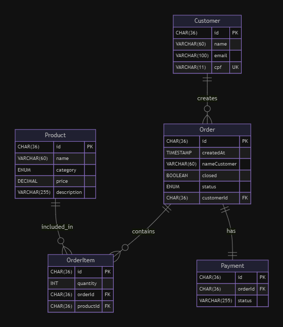
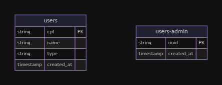

# SELF SERVICE TOTEM

 [](https://github.com/evilfeeh/self-service-totem/actions/workflows/setup-test-build-pipeline.yml)

 [](https://github.com/evilfeeh/self-service-totem/actions/workflows/setup-test-build-pipeline.yml)


This Project about Tech Challenge from FIAP
A monolith backend Developed with TypeScript, Docker, DDD and hexagonal architecture.

## ABOUT

We're introducing an Software that aims to optimize the self-service process in fast-food restaurants. Through an interactive totem, customers can place their orders quickly, conveniently and autonomously, reducing queues and speeding up service.

Our **Event Storming** can be found here: https://miro.com/app/board/uXjVKVP2yDY=/

For more details about the project, access: https://github.com/evilfeeh/self-service-totem

## POSTGRADUATION PHASES

As this projects are being built due the FIAP postgraduation, we use the [github wiki](https://github.com/evilfeeh/self-service-totem/wiki) to documentation the details of each phase and also provide more information if necessary.

## FEATURES

-   Customer:
    -   [x] Register a new customer
    -   [x] identify a customer by their CPF
-   Product:
    -   [x] Create, update and delete a product
    -   [x] Find a product by category
-   Orders:
    -   [x] Register a new order
    -   [x] Simulate checkout process (fake checkout)
    -   [x] List orders

## ubiquitous Language Dictionary

-   Cliente (Customer): Person who will consume the order
-   Pedido (Order): The order with all customer's Items
-   Cozinha (Kitchen): Team preparing the items of order
-   Pagamento (Payment): Process to pay the order
-   Lanche, Acompanhamento, Bebida, Sobremesa: Items avaiable into the menu

## PREREQUISITES

  

## HOW TO SETUP:

Clone the project repository:

```bash
git clone https://github.com/evilfeeh/self-service-totem.git
```

Access the project directory:

```bash
cd self-service-totem
```

Run the application with Docker Compose:

```bash
docker compose up
```

The apps runs into port 3000, it's possible to change the value port or other environments inside a .env file

To access the docs, access:
`http://localhost:3000/public/docs`

## Accessing the API

After running everything, you can use the `Kubectl` commands to ensure the pods are initialized. To access the Swagger aplication, you'll need to port fowarding the api.

Specify the API's pod name and run:

```bash
kubectl port-forward <api-pod-name> 3000:3000
```

# PHASE 3 DATABASE JUSTIFICATION

The Self Service Totem project uses MySQL RDS for storing Product, Payment, and Order data due to the need for transactional consistency and complex relationships between these entities, which relational databases handle well. DynamoDB is used to store user information, leveraging its high scalability and low latency for frequent queries and fast access. Security is enhanced through a Lambda Authorizer integrated with API Gateway for efficient access control within the serverless architecture.

## RDS MySql



## DynamoDB


