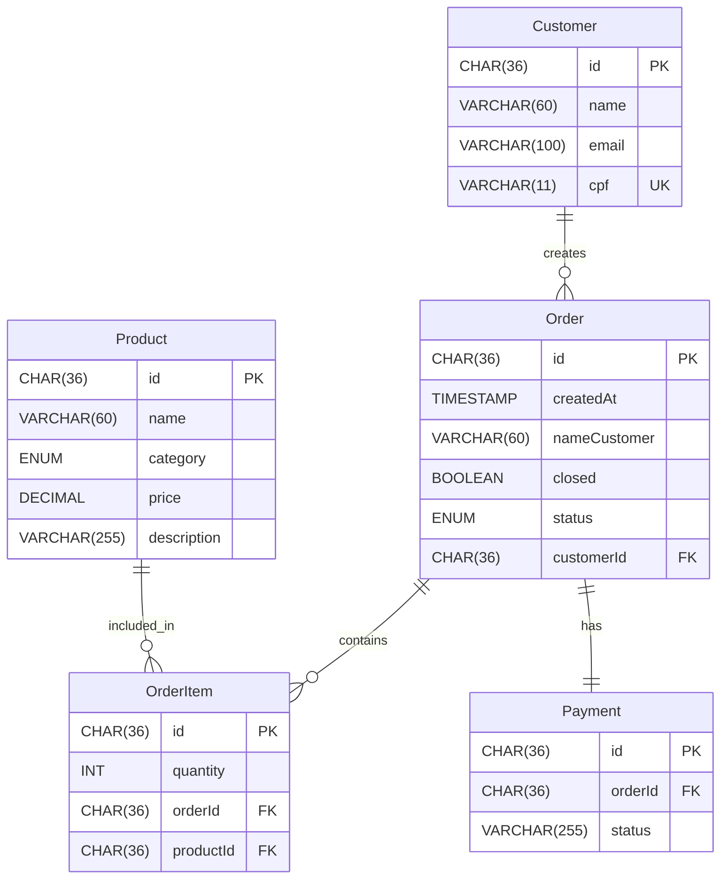

```mermaid
erDiagram
    Customer ||--o{ Order : creates
    Order ||--o{ OrderItem : contains
    Order ||--|| Payment : has
    Product ||--o{ OrderItem : included_in

    Customer {
        CHAR(36) id PK
        VARCHAR(60) name
        VARCHAR(100) email
        VARCHAR(11) cpf UK
    }

    Order {
        CHAR(36) id PK
        TIMESTAMP createdAt
        VARCHAR(60) nameCustomer
        BOOLEAN closed
        ENUM status
        CHAR(36) customerId FK
    }

    OrderItem {
        CHAR(36) id PK
        INT quantity
        CHAR(36) orderId FK
        CHAR(36) productId FK
    }

    Product {
        CHAR(36) id PK
        VARCHAR(60) name
        ENUM category
        DECIMAL price
        VARCHAR(255) description
    }

    Payment {
        CHAR(36) id PK
        CHAR(36) orderId FK
        VARCHAR(255) status
    }
```